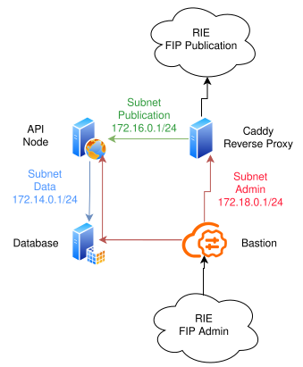

# SharedAgenda
SharedAgenda is our project for the end of our year as probationary civil
servants in ENFiP Toulouse as Inspectrices PSE.

It has two different main components, the [server](crates/server) and the
[cli](crates/cli).

See their different README for more information and documentation.

## Build
To build SharedAgenda you first need to install `podman` on your machine. 
Then, use this command to create a podman container suitable for compiling the
server.

```sh 
podman build -t rust-builder -f Containerfile
```

Use the script `cargo-podman` to compile the server.

### All
```sh
make all
```

### Server
```sh
cargo podman build --release --bin server
#OR 
make server
```

### Client
```sh
cargo build --release --bin cli
#OR 
make cli
```

Alternatively you can use the pre-compiled binaries
- `server` is in `02-configuration/files/server`
- `cli` is in `assets/cli`

## Deployment
SharedAgenda is hosted on NUBO, it uses _terraform_ for the creation of the VMs
and _ansible_ for the configuration. 

### Deployment on NUBO
You need to place `clouds.yaml` and `secure.yaml` in `01-platform` and sim link
them in `02-configuration`

```sh 
. env.sh #do the steps
python3 -m pip install -r r.txt #install the components

cd 01-platform
tf apply #deploy the infrastructure

cd ../02-configuration
ansible-playbook -i inventory sharedagenda.playbook.yaml #configure servers
```

## Documentation

See the [server's README](crates/server/README.md) for the endpoints and how to
use the API.

See the [cli's REAMDE](crates/cli/README.md) for the manual.

## Diagram

### V1
Here is the diagram for the deployed V1 infrastructure.

[](assets/infrastructure_v1.png)

### V2
Here is the diagram for the deployed V2 infrastructure.

[](assets/infrastructure_v2.png)
