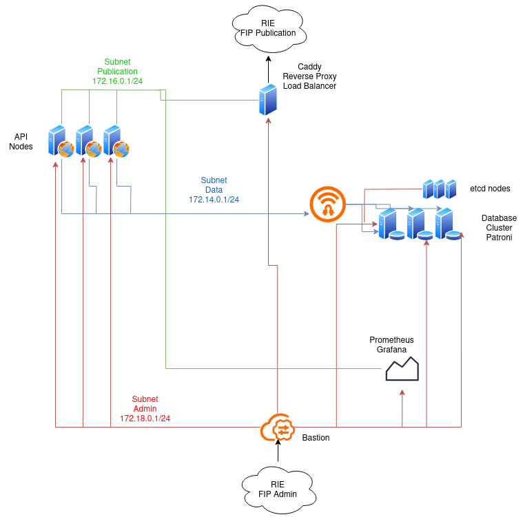

# SharedAgenda

> [!CAUTION]
> This project is FOR FUN AND LEARNING ONLY.
> Do NOT under ANY CIRCUMSTANCES use your REAL EMAIL.
> You would be at risk of LEAKING such an email because of the `/user/list` endpoint.
> Even if the passwords are hashed DO NOT use your own password.
> You have been warned!!


SharedAgenda was my project for the end of my year as probationary civil
servants in ENFiP Toulouse as Inspectrice PSE (think system administrator).

The deployed version of SharedAgenda is v2.3.0-prod. See the diagrams below.

The dev version of SharedAgenda is v3.0.0-dev

It has two different main components, the [server](crates/server) and the
[cli](crates/cli).

See their different README for more information and documentation.

## Live APIs
### DGFiP
For the DGFiP's Network the live API is available until june at

```
http://api-shag-01.enfip-dev-devops.dgfip.nuage01.fi.francecloud.rie.gouv.fr
````

### Internet
An API will (soon) be opened at

```
https://api.sharedagenda.faefox.dev
#OR
https://api.sharedagenda.charlotte-thomas.me
```

## Build
To build SharedAgenda you first need to install `podman` on your machine. 
Then, use this command to create a podman container suitable for compiling the
server.

The script `builder` is here if you don't have a rust toolchain installed on
your machine. It uses the podman container to compile without need to install
the toolchain.

```sh 
podman build -t rust-builder -f Containerfile
```

Use the script `cargo-podman` to compile the server.

### All

If you don't have a rust toolchain installed simply type:
```sh
make
```

Alternatively if you have one
```sh
make all
```

### Server
If you don't have a rust toolchain installed:
```sh
./builder build --release --bin server
#OR 
make podman_server
```

Alternatively if you have the rust toolchain installed just do
```sh
cargo build --release --bin server
#OR
make server
```

### Client
If you don't have a rust toolchain installed:
```sh
./builder build --release --bin cli
#OR
make podman_cli
```

Alternatively if you have one,
```sh
cargo build --release --bin cli
#OR
make cli
```

## Deployment
SharedAgenda is hosted on NUBO, it uses _terraform_ for the creation of the VMs
and _ansible_ for the configuration. 

### Deployment on Openstack

> [!WARNING]
> You **must** modify the `env.sh` file for your own needs, by default it uses the DGFiP's Git Forge and proxy.
> If you are deploying this on another openstack, you MUST update the script.

You need to put `clouds.yaml` and `secure.yaml` in `01-platform` and sim link
them in `02-configuration`

```sh 
. env.sh #follow the steps
python3 -m pip install -r r.txt #install the required ansible components

cd 01-platform 
tf apply #deploy the infrastructure on openstack

cd ../02-configuration
ansible-playbook -i inventory sharedagenda.playbook.yaml #configure servers
```

## Documentation

See the [server's README](crates/server/README.md) for the endpoints and how to
use the API.

See the [cli's REAMDE](crates/cli/README.md) for how to use the CLI/REPL.

## Diagram

### V1
Here is the diagram for the deployed V1 infrastructure.

[](assets/infrastructure_v1.png)

### V2
Here is the diagram for the deployed V2 infrastructure.

*Version shown is v2.2.0-prod, there is a monitoring machine in v2.3.0-prod*

[](assets/infrastructure_v2.png)

### V3
Here is the diagram for the deployed V3 infrastructure

[](assets/infrastructure_v3.png)
